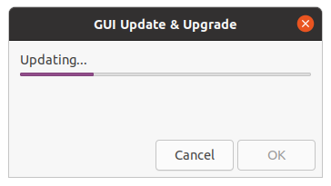
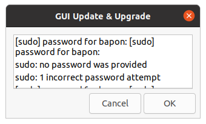
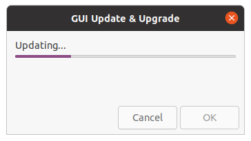
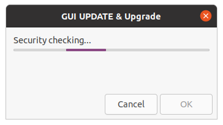
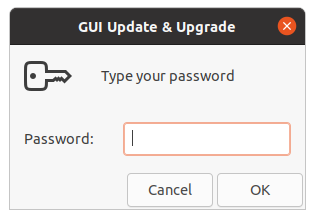

# GUI PACKAGES LINUX UPDATE , UPGRADE AND SECURITY CHECK FOR YOUR MACHINE IN BASH SHELL SCRIPT

#####Version - 2.2.2

#####License - GNU GPL V-3.0
-----------------------------------------------------------------------------------------------------------------------------
## 
Dependency :
- [ x ] zenity : `sudo apt install zenity -y`
- [ x ] rkhunter : `sudo apt install rkhunter -y`

###
This bash shell script is for update,upgrade packages and also check the security warning by RootKit Hunter package. You just need to clone this repository and change working directory into cloned directory and then run script in terminal by `./gui_update_1.sh`. Now all information and messages are shown in graphical user interface.

Screenshots :

